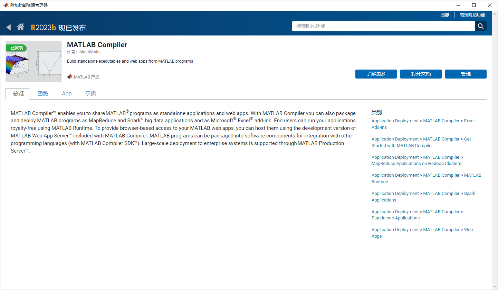
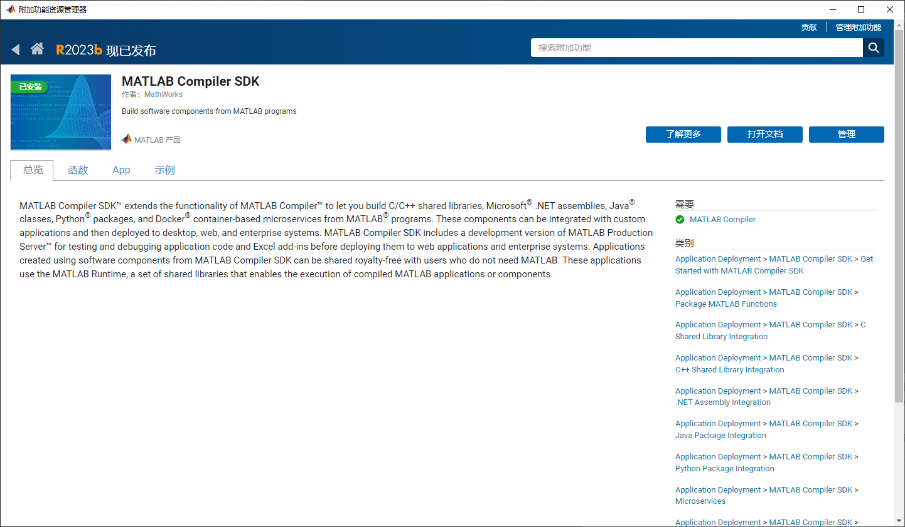
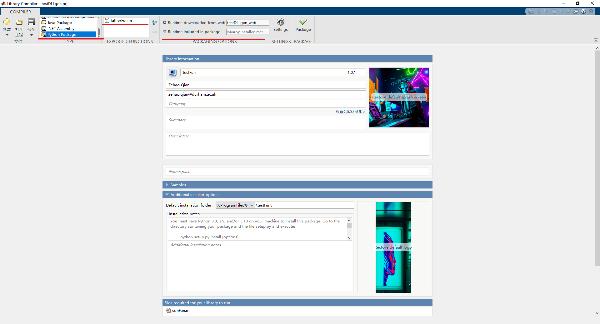

# TEAS 2.0 Guide for Using MATLAB Modules in C# and Python
English Version | [中文文档](README_cn.md)

As TEAS 1.0 was primarily composed of numerous MATLAB scripts, rebuilding it in a new language would incur significant costs. Therefore, we've opted to design an automated pipeline to compile the existing MATLAB `.m` scripts into both C# and Python. This guide serves as an example, using Python to validate the feasibility of this approach.

## 1 Development Environment
### 1.1 Operating System
Windows 10 Professional

### 1.2 Python Miniconda
Download Miniconda from [https://docs.conda.io/projects/miniconda/en/latest/](https://docs.conda.io/projects/miniconda/en/latest/).

#### Download and Activate a Conda Virtual Environment
```bash
# Configure the conda environment
conda create -n TEAS python=3.10
# Activate the conda environment
conda activate TEAS
```

### 1.3 MATLAB
#### 1.3.1 MATLAB Version
MATLAB R2023A - For consistency and to ensure successful installation of MATLAB Compiler SDK, use this version. Note that as of October 17, 2023, I encountered issues with MATLAB Compiler SDK installation for R2023b.

#### 1.3.2 MATLAB Add-Ons
##### MATLAB Compiler


##### MATLAB Compiler SDK


## 2 Writing Test Scripts
The following three files should be placed in the same directory.

### 2.1 Parent and Child Functions
```MATLAB
function result = fatherFun(input)
    % This is the main function that depends on b.m
    % Perform some computations using functions from both a.m and b.m
    result = sonFun(input) * 2;
end
```

```MATLAB
function output = sonFun(input)
    % This is the dependency function
    % Perform some computations
    output = input + 1;
end
```

### 2.2 Test Function
```MATLAB
% Sample script to demonstrate execution of function result = fatherFun(input)
input = 4; % Initialize input here
result = fatherFun(input);
```

## 3 Compiling MATLAB Scripts into a Python Package
### 3.1 Compile Distributable Files
Enter `libraryCompiler` in the MATLAB terminal to open the MATLAB Library Compiler.


One important note is to ensure the test script is selected; otherwise, the generated Python files will not know how to be called in Python. If you have a test script, the generated Python files will have an example. Simply mimic that script to make the calls.

Click "Package" to start the packaging process. This will generate a folder in the same directory as the project file, with the same name as the project file. Inside this folder, there are three subfolders (for_redistribution and two others). In the for_redistribution folder, you'll find an `.exe` file that is used for distribution. On other computers where you need to use this code, double-click this file, and it will automatically install MATLAB Runtime and the Python scripts.

### 3.2 Installation into Python Environment
Open the Conda environment created in step 1, navigate to the directory where the distribution file produced by the `.exe` is located. In this directory, you will find files like `setup.py`. In the terminal in this directory, activate your Conda environment and execute the following command to install the MATLAB-generated Python scripts into your Conda environment:
```bash
python setup.py install
```

### 3.3 Testing Whether Functions Run Successfully
Use the Python script provided in the "sample" folder generated by the test script. The code is as follows:
```python
#!/usr/bin/env python
"""
Sample script that uses the testFun module created using
MATLAB Compiler SDK.

Refer to the MATLAB Compiler SDK documentation for more information.
"""

import testFun
# Import the matlab module only after you have imported
# MATLAB Compiler SDK generated Python modules.
import matlab

my_testFun = testFun.initialize()

inputIn = matlab.double([4.0], size=(1, 1))
resultOut = my_testFun.fatherFun(inputIn)
print(resultOut, sep='\n')

my_testFun.terminate()
```

Please note that if the `import matlab` line is highlighted with a yellow squiggly line in your code editor, you can ignore it. Do not install the `matlab` package via pip!
