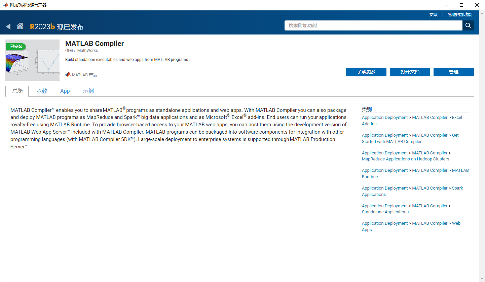
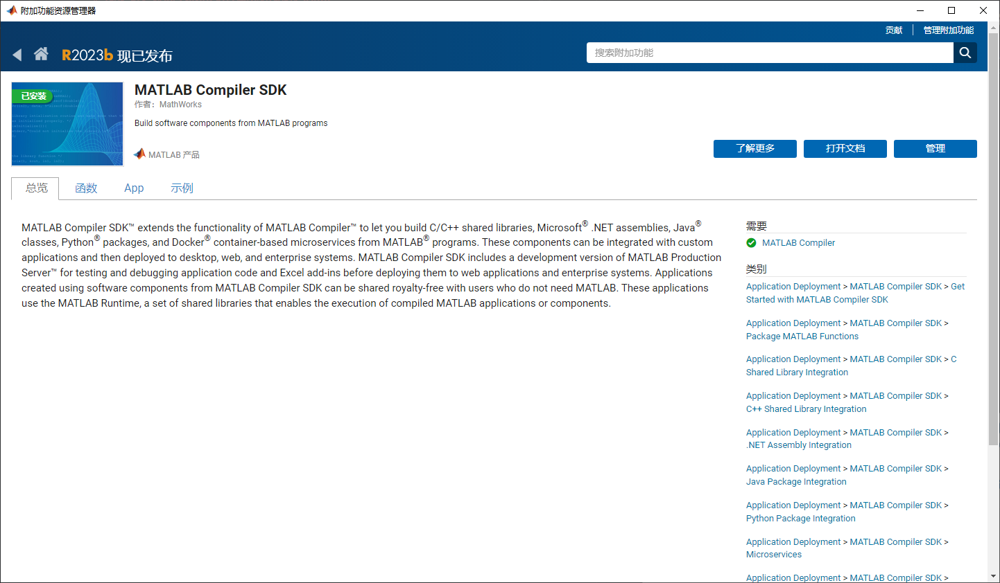
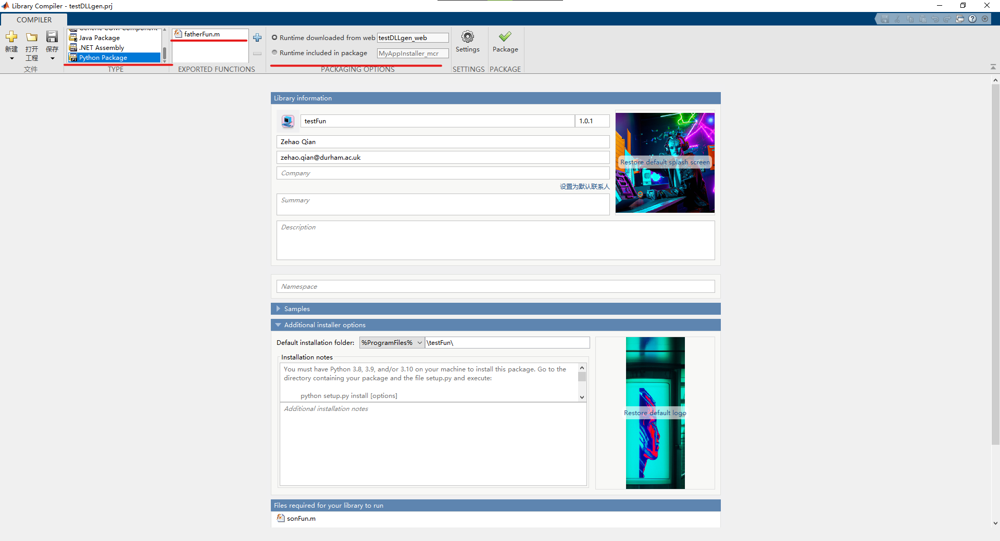

# TEAS 2.0 C#和Python等语言调用MATLAB模块指南
[English Version](./README.md) | 中文文档

由于TEAS 1.0程序是由大量MATLAB脚本组合而成的，重新使用一门新的语言构建2.0版本成本极高，因此我们使用MATLAB的MATLAB Compiler以及MATLAB Compiler SDK设计自动化流水线编译原先的MATLAB m脚本到C#或是Python。本指南以Python为例验证该方法的可行性。
## 1 开发环境
### 1.1 操作系统
Windows 10 专业版
### 1.2 Python Miniconda
下载Miniconda，[https://docs.conda.io/projects/miniconda/en/latest/](https://docs.conda.io/projects/miniconda/en/latest/)
#### 下载并激活conda虚拟环境
```bash
# 配置conda环境
conda create -n TEAS python=3.10
# 激活conda环境
conda activate TEAS
```
### 1.3 MATLAB
#### 1.3.1 MATLAB版本
MATLAB R2023A，由于本人在2023年10月17日尝试过R2023b版本，但发现MATLAB Compiler SDK安装失败，因此为了保证成功，请统一版本。
#### 1.3.2 MATLAB附加功能
##### MATLAB Compiler

##### MATLAB Compiler SDK

## 2 编写测试脚本
下面三个文件放在同一个目录下面。
### 2.1 子函数与父函数
```MATLAB
function result = fatherFun(input)
    % This is the main function that depends on b.m
    % Perform some computations using functions from both a.m and b.m
    result = sonFun(input) * 2;
end
```

```MATLAB
function output = sonFun(input)
    % This is the dependency function
    % Perform some computations
    output = input + 1;
end
```
### 2.2 测试函数
```MATLAB
% Sample script to demonstrate execution of function result = fatherFun(input)
input = 4; % Initialize input here
result = fatherFun(input);
```
## 3 编译MATLAB脚本为Python包
### 3.1 编译可分发文件
在MATLAB终端输入`libraryCompiler`打开MATLAB Library Compiler。

值得提醒的一点是切记将测试脚本那一栏选上，否则到Python代码的会不知道如何调用。如果有测试脚本的话，生成的Python文件会有一个案例，直接模仿那个脚本调用就可以了。

点击Package就可以进行打包了，会在这个工程文件同目录下生成一个与此工程文件同名的文件夹，里面有三个文件夹(for_redistribtion和另外两个)，点开for_redistribtion文件夹后会看到一个exe文件，那个就是用来分发的文件。在其他需要调用的环境双击此文件，就可以自动安装MATLAB Runtime和Python脚本了。

### 3.2 安装到Python环境中
打开在1中创建的conda环境，切换到运行分发文件那个exe所生成的文件夹中 ，会看到`setup.py`等文件，在此目录下打开终端，启动conda环境，输入如下指令安装MATLAB生成的Pyhton脚本至conda环境：
```bash
python setup.py install
```
### 3.3 测试函数是否能正常运行
使用由测试脚本生成的sample文件夹中的python文件进行测试。代码如下：
```python
#!/usr/bin/env python
"""
Sample script that uses the testFun module created using
MATLAB Compiler SDK.

Refer to the MATLAB Compiler SDK documentation for more information.
"""

import testFun
# Import the matlab module only after you have imported
# MATLAB Compiler SDK generated Python modules.
import matlab

my_testFun = testFun.initialize()

inputIn = matlab.double([4.0], size=(1, 1))
resultOut = my_testFun.fatherFun(inputIn)
print(resultOut, sep='\n')

my_testFun.terminate()

```
注意如果是`import matlab`代码在编辑器中标黄色波浪线，请忽略，切记不要通过pip安装matlab这个包！